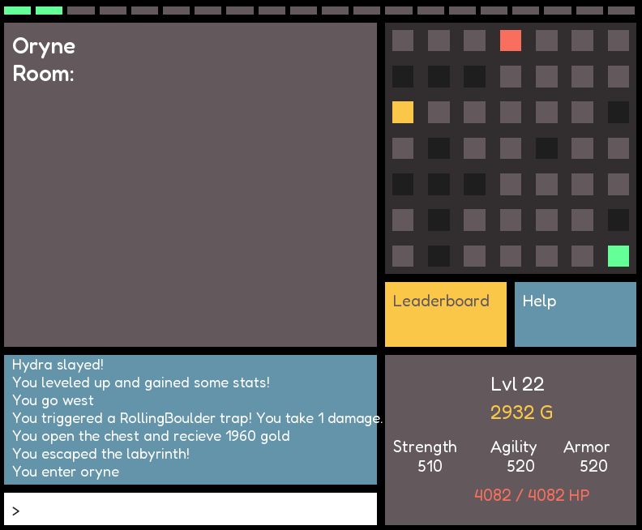

# Wake of Ariadne
A retro-inspired dungeon crawler, drawing inspiration from Greek mythology, where typing speed determines your fate in battle. Navigate through Greek mythology-themed dungeons using the terminal.
Wake of Ariadne combines classic dungeon crawling with speedtyping mechanics.
Avialable at: https://lukasbygmal.itch.io/wake-of-ariadne

The game is built in c++, with a backend in PostgreSQL and a Flask REST API. Additionally, it uses OAuth with github.

## How to run

### C++
install curl, sfml and openssl
make run

### Rest API
To run locally:
source game_api_env/bin/activate
export OAUTHLIB_INSECURE_TRANSPORT=1 (to allow http)
python3 app.py

To deploy:
use the procfile + requirments

### PostgreSql DB
Set up db according to create_tables.sql

### OAuth
https://docs.github.com/en/apps/oauth-apps/building-oauth-apps/creating-an-oauth-app

### Compiling for windows (on linux)
install openssl, sfml and curl windows-libraries
cacert.pem is required
make -f Makefile.windows

### Note
Obviously you'd need to change api keys, urls etc.